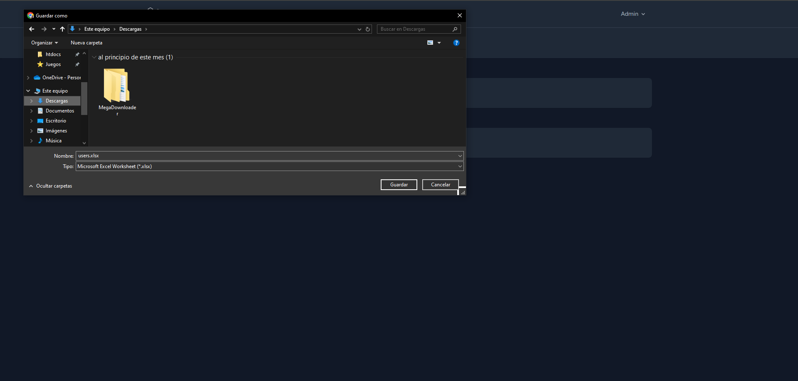

# Instalación de Proyecto de Laravel


Como opcion a servidor web, una de las mas populares es XAMPP

```
https://www.apachefriends.org/es/download.html
```

Sigue estos pasos para instalar localmente un proyecto de Laravel:

1: **Clona el repositorio**

```
git clone https://github.com/usuario/proyecto.git
```

2: **Cambia al directorio del proyecto**

```
cd proyecto
```

3: **Instala las dependencias de Composer**

```
composer install
```

4: **Copia el archivo de entorno de ejemplo y configura tu entorno**

5: **Genera una clave de aplicación**

```
php artisan key:generate
```

6: **Ejecuta las migraciones**

```
php artisan migrate
```


# Generar un usuario administrador

Con el comando `generate:admin-user` se genera un usuario administrador con las siguientes credenciales:

```php
'name'     => 'Admin',
'email'    => 'admin@admin.com',
'password' => 'password',
```

Este usuario podrá iniciar sesión para tener la posibilidad de elegir un ganador (Un usuario al azar entre los registrados) o exportar los usuarios registrados en un archivo Excel.

# Screenshots





